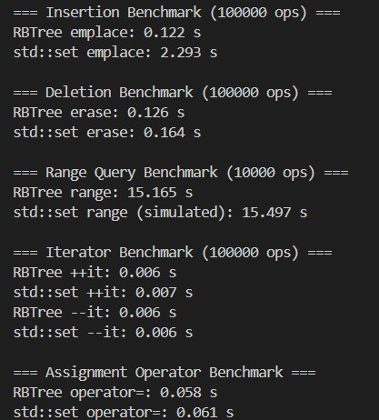
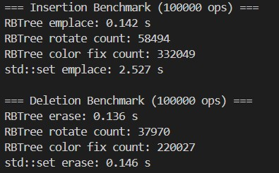

# 性能对比 ： RBTree和std::set

## 测试数据
用随机数生成了1e5个数据用于`emplace`和`delete`的样本

为了测试时间不要太长，生成了1e4组数据用于测试`range`函数
> 由于`std::set`中不自带`range`函数，我在测试的cpp文件中进行了模拟
> ```c++
>  for (const auto& p : ranges) {
>           if (p.first > p.second) continue;
>           auto it_l = ss.lower_bound(p.first);
>           auto it_r = ss.upper_bound(p.second);
>           total += std::distance(it_l, it_r);
>       }
> ```

分别进行1e5次迭代的的`++`和`--`，为了防止越界，用循环方式

分别进行一次大小为1e5的容器的`= operator`操作

## 实验结果分析

### 插入元素`emplace`
`std::set`会调用实际会调用 `_Rb_tree::_M_emplace_hint_unique, _M_create_node, _M_insert_unique`.每次构造节点时会通过`allocator`分配并调用构造函数，异常安全处理很多。
同时，有多重层层封装，如：`_Rb_tree_node_allocator, _Rb_tree_impl, allocator_traits, std::_Construct`

**相较之下`Eset`调用层数少，对安全性的判断少，速度更快**
### 删除元素`delete`
`std::set`会调用 `_M_erase, _M_rebalance_for_erase, _M_drop_node`, 有很多额外检测。同时，内部 `_Rb_tree_erase_rebalance` 复杂。最后有 `_M_destroy_node` 做回收

**相较之下`ESet`的`transplant，fixDelete`功能更简洁，速度更快**

旋转次数上，`std::set`在 Debug 模式下还会执行`_GLIBCXX_DEBUG_VERIFY`，`ESet::fixDelete` 仅处理最需要平衡的情况

### 求范围内个数`range`
`std::set`中`range`功能使用`lower_bound`和`upper_bound`模拟，用到`allocator`速度慢，`Eset`无`allocator`**速度稍快**

### 迭代器操作`++`，`--`

`std::set`中`operator++` 内部基于 `_Rb_tree_increment`，路径会通过指针爬升。同时，有检查 `__is_node_ptr`安全性校验
相较之下`ESet`明确维护 `_minNode`，使 `begin()` 快速，**速度更快**

### 拷贝构造`= operator`
`std::set`需调用 `allocator` 的拷贝构造器、内部结构复制、全新构建树。有 `_Rb_tree_copy, _Rb_tree_insert_and_rebalance`，递归开销较大
`Eset`的`copyTree`更简洁，**速度快**

## 小结
`std::set`比我自己用红黑树实现的ESet速度慢的原因主要在于其中对于安全性的校验比较多，`Eset`的实现以简洁实现基本功能为主。

## 附件
测试数据1



测试数据2


